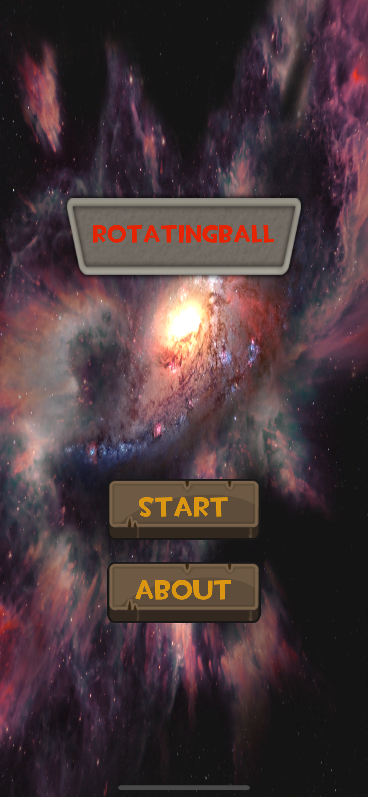
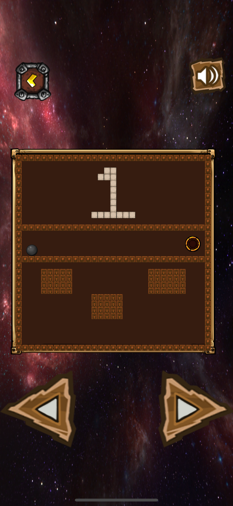
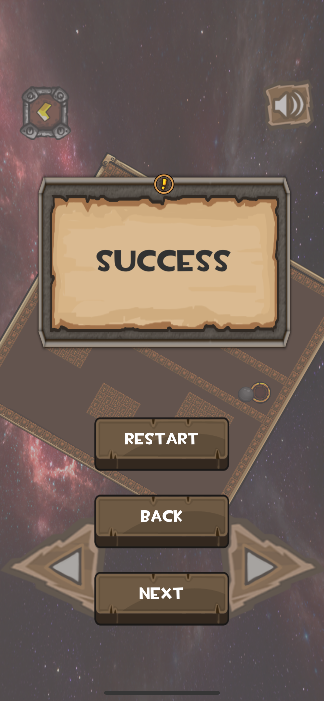

# Rolling-and-Rotating
unity2d mobile game.

 
unity益智游戏 
适用于移动平台

- [玩法介绍](#玩法介绍)
- [游戏截图](#游戏截图)
- [所学技术](#所学技术)
- [所用资源](#所用资源)
- [联系方式](#联系方式)

## 玩法介绍
- 玩家可以通过按钮旋转整个面板，并躲过陷阱，控制小球掉入终点。

## 游戏截图
- 开始页面
 
- 关卡页面
 
- 关卡结算页面
 

## 所学技术
- `TileMap`绘制地图
- 单例控制全局音乐
- 特效使用
- 教程面板

## 所用资源
1. 来自[爱给网](http://www.aigei.com/)音频资源
2. 来自unity AssetStore的免费资源

## 联系方式
- 邮箱:739296759@qq.com
